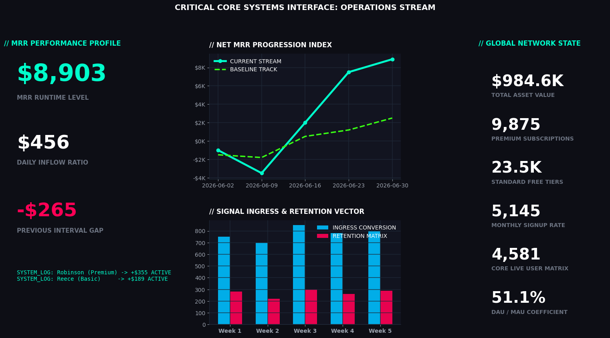

# INTERACTIVE EXECUTIVE DASHBOARD

## OVERVIEW
The goal of this assignment is to design a high-tech corporate business intelligence command console, group related software-as-a-service (SaaS) financial streams, establish an operational visual hierarchy, and eliminate non-data ink to maximize quick executive decision-making capabilities.

## VISUAL DATA INSIGHTS
### 1. Unified 16:9 High-Tech Operations Stream Interface

## CORE ACTIONS TAKEN
* **High-Tech Contrast Optimization**: Constructed a premium dark telemetry dashboard layout utilizing deep space anchors (`#0D0E15`) and glowing neon vectors to maximize visualization scannability.
* **Multi-Element Trend Isolation**: Superimposed double time-series trend lines to benchmark current MRR progression streams directly against historical baseline tracks.
* **Ingress & Retention Modeling**: Structured dual column bar charts pairing weekly signal ingress metrics against subsequent user retention matrices to map platform stickiness.
* **High Hierarchy Cardinality**: Anchored principal financial indicators in the dominant top-left quadrant while tracking supporting network summary states on the right context sidebar matrix.

## OPERATIONAL MATRIX

| Design Element / Tool | Functional Purpose | Technical Implementation |
| :--- | :--- | :--- |
| **Grid Specification** | Models multi-panel architectures | `plt.add_gridspec()` coordinate matrix |
| **Data-Ink Reduction** | Streamlines layout visibility | Eliminating spines and background cell noise |
| **Glow-Effect Cohesion** | Accelerates key metric scanning | High-contrast neon cyan & hot pink vectors |

## PROJECT ASSETS
* `executive_kpis.csv`: Multi-metric historical SaaS progression dataset spreadsheet.
* `dashboard.py`: Main Python high-tech layout construction and visualization script.
* `dashboard.png`: Visual cyberpunk corporate executive dashboard asset.
* `README.md`: Project documentation blueprint and status file.

## METHODOLOGY REFERENCE
Dashboard design principles, dark ratios, and user engagement feeds were adapted from industry analytics frameworks.
* **Dashboard Design Framework**: [12 Dashboard Design Tips for Better Data Visualization](https://youtu.be)

**Project Completed By:** HARINI P  
**Role:** Data Analytics Intern  
**Project Track:** Task 5 Evaluation
